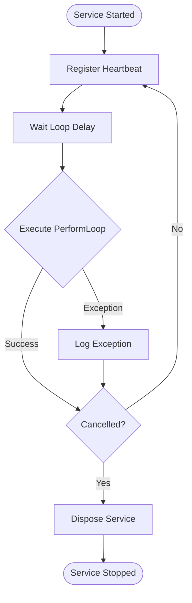
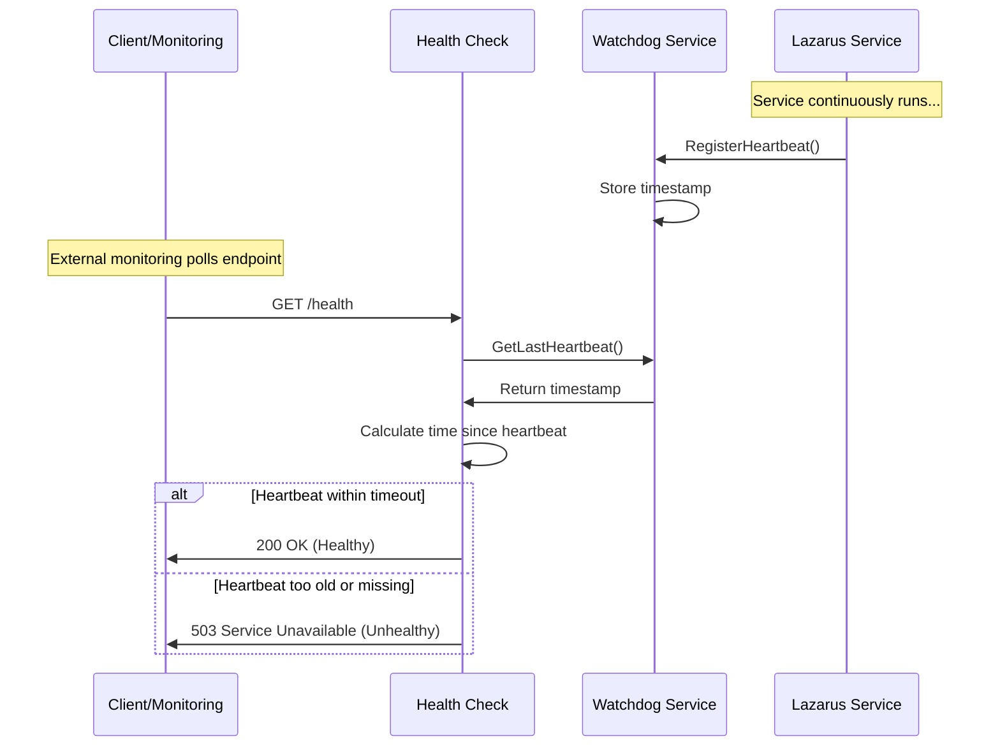
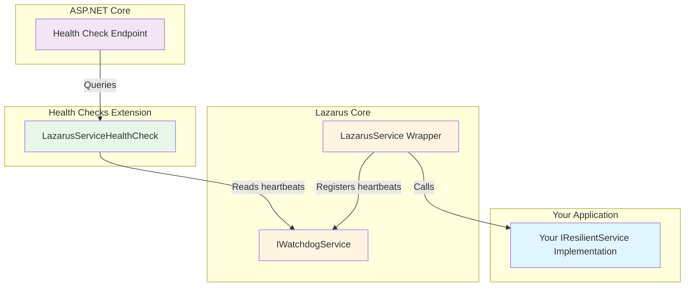

# Lazarus

[](https://github.com/hughesjs/Lazarus/actions)
[](https://nuget.org/packages/Lazarus)
[](https://nuget.org/packages/Lazarus.Extensions.HealthChecks)

[](LICENSE)


A bulletproof BackgroundService implementation with auto-resurrection and heartbeat monitoring.

## Overview

Lazarus wraps your background services in a resilient `BackgroundService` implementation that never dies. When exceptions occur, they're logged and the service continues running - no crashes, no restarts needed.

The library consists of two packages:
- **Lazarus**: Core resilient service wrapper with heartbeat monitoring
- **Lazarus.Extensions.HealthChecks**: ASP.NET Core health check integration

Perfect for queue processors, scheduled tasks, monitoring services, and any long-running background work that needs to stay alive.

## Features

- **Exception isolation**: Exceptions in your service loop are caught, logged, and the loop continues
- **Heartbeat monitoring**: Built-in watchdog tracks service health via heartbeats
- **Health check integration**: ASP.NET Core health checks monitor service responsiveness
- **Configurable loop delay**: Control the interval between service iterations
- **Clean shutdown**: Proper cancellation token handling for graceful termination
- **Multiple services**: Run and monitor multiple independent background services

## Installation

**Requirements**: .NET 10.0 or later

**Core package**:
```bash
dotnet add package Lazarus
```

**Health checks extension** (optional):
```bash
dotnet add package Lazarus.Extensions.HealthChecks
```

## Quick Start

### 1. Implement `IResilientService`

```csharp
using Lazarus.Public;

public class MyBackgroundWorker : IResilientService
{
    private readonly ILogger<MyBackgroundWorker> _logger;

    public MyBackgroundWorker(ILogger<MyBackgroundWorker> logger)
    {
        _logger = logger;
    }

    public string Name => "MyBackgroundWorker";

    public async Task PerformLoop(CancellationToken cancellationToken)
    {
        // Your work here - exceptions won't kill the service
        _logger.LogInformation("Processing batch...");
        await ProcessQueuedItems(cancellationToken);
    }

    public ValueTask DisposeAsync()
    {
        // Cleanup resources
        _logger.LogInformation("Service shutting down");
        return ValueTask.CompletedTask;
    }

    private async Task ProcessQueuedItems(CancellationToken cancellationToken)
    {
        // Your processing logic
        await Task.Delay(100, cancellationToken);
    }
}
```

### 2. Register with Dependency Injection

```csharp
using Lazarus.Public.Configuration;

var builder = WebApplication.CreateBuilder(args);

// Register your resilient service
builder.Services.AddLazarusService<MyBackgroundWorker>(
    loopDelay: TimeSpan.FromSeconds(5)
);
```

The `loopDelay` parameter controls how long to wait between each call to `PerformLoop`.

### 3. Add Health Checks (Optional)

```csharp
using Lazarus.Extensions.HealthChecks.Public;

// Add health checks
builder.Services.AddHealthChecks()
    .AddLazarusHealthCheck<MyBackgroundWorker>(
        timeout: TimeSpan.FromSeconds(30)
    );

var app = builder.Build();

// Map health check endpoint
app.MapHealthChecks("/health");

app.Run();
```

That's it! Your background service will now run continuously, survive exceptions, and report its health status.

## How It Works

Lazarus wraps your `IResilientService` in a `BackgroundService` that:

1. Registers a heartbeat with the watchdog before each iteration
2. Waits for the configured loop delay
3. Calls your `PerformLoop` method in a try-catch block
4. Logs any exceptions and continues running
5. Only stops when cancellation is requested



The watchdog service tracks when each background service last reported being alive. Health checks query the watchdog to determine if services are responsive.

## Health Checks Integration

The `Lazarus.Extensions.HealthChecks` package provides seamless integration with ASP.NET Core's health check system.

### Basic Setup

```csharp
builder.Services.AddHealthChecks()
    .AddLazarusHealthCheck<MyBackgroundWorker>(
        timeout: TimeSpan.FromSeconds(30)
    );
```

### Configuration Options

```csharp
builder.Services.AddHealthChecks()
    .AddLazarusHealthCheck<MyBackgroundWorker>(
        timeout: TimeSpan.FromSeconds(30),           // Required: Max time since last heartbeat
        customName: "background-worker-health",      // Optional: Custom health check name
        failureStatus: HealthStatus.Degraded,        // Optional: Status to report on failure (default: Unhealthy)
        tags: new[] { "background", "critical" }     // Optional: Tags for filtering
    );
```

### Health Check Response

When healthy, the health check returns:
```json
{
  "status": "Healthy",
  "results": {
    "background-worker-health": {
      "status": "Healthy",
      "description": "Service MyBackgroundWorker is healthy",
      "data": {
        "service": "MyBackgroundWorker",
        "lastHeartbeat": "2025-12-18T10:30:45Z",
        "timeSinceHeartbeat": "00:00:02.1234567",
        "timeout": "00:00:30"
      }
    }
  }
}
```

When unhealthy (heartbeat timeout exceeded or no heartbeat):
```json
{
  "status": "Unhealthy",
  "results": {
    "background-worker-health": {
      "status": "Unhealthy",
      "description": "Service MyBackgroundWorker heartbeat timeout exceeded",
      "data": {
        "service": "MyBackgroundWorker",
        "lastHeartbeat": "2025-12-18T10:29:00Z",
        "timeSinceHeartbeat": "00:01:45.1234567",
        "timeout": "00:00:30"
      }
    }
  }
}
```

### How Health Checks Work

Health checks are executed **on-demand** when the `/health` endpoint is called (e.g., by Kubernetes, load balancers, or monitoring tools). They don't run periodically in the background.



## Real-World Examples

### Example 1: Queue Processor

A background service that continuously processes messages from a queue, demonstrating exception resilience.

```csharp
using Lazarus.Public;
using System.Collections.Concurrent;

public class QueueProcessor : IResilientService
{
    private readonly ILogger<QueueProcessor> _logger;
    private readonly ConcurrentQueue<string> _messageQueue;
    private readonly IMessageService _messageService;

    public QueueProcessor(
        ILogger<QueueProcessor> logger,
        IMessageService messageService)
    {
        _logger = logger;
        _messageService = messageService;
        _messageQueue = new ConcurrentQueue<string>();
    }

    public string Name => "QueueProcessor";

    public async Task PerformLoop(CancellationToken cancellationToken)
    {
        // Fetch new messages
        var messages = await _messageService.FetchMessagesAsync(cancellationToken);
        foreach (var message in messages)
        {
            _messageQueue.Enqueue(message);
        }

        // Process one message per loop iteration
        if (_messageQueue.TryDequeue(out var msg))
        {
            _logger.LogInformation("Processing message: {Message}", msg);

            // This might throw an exception, but the service will continue
            await ProcessMessageAsync(msg, cancellationToken);

            _logger.LogInformation("Message processed successfully");
        }
    }

    private async Task ProcessMessageAsync(string message, CancellationToken cancellationToken)
    {
        // Simulate processing that might fail
        if (message.Contains("corrupt"))
        {
            throw new InvalidDataException($"Corrupt message: {message}");
        }

        await _messageService.ProcessAsync(message, cancellationToken);
    }

    public ValueTask DisposeAsync()
    {
        _logger.LogInformation("Queue processor shutting down. Remaining messages: {Count}",
            _messageQueue.Count);
        return ValueTask.CompletedTask;
    }
}

// Registration in Program.cs
builder.Services.AddSingleton<IMessageService, MessageService>();
builder.Services.AddLazarusService<QueueProcessor>(
    loopDelay: TimeSpan.FromSeconds(1) // Check for new messages every second
);
```

### Example 2: Scheduled Task Runner

A background service that runs periodic maintenance tasks with longer intervals.

```csharp
using Lazarus.Public;

public class DatabaseMaintenanceService : IResilientService
{
    private readonly ILogger<DatabaseMaintenanceService> _logger;
    private readonly IDbContext _dbContext;

    public DatabaseMaintenanceService(
        ILogger<DatabaseMaintenanceService> logger,
        IDbContext dbContext)
    {
        _logger = logger;
        _dbContext = dbContext;
    }

    public string Name => "DatabaseMaintenance";

    public async Task PerformLoop(CancellationToken cancellationToken)
    {
        _logger.LogInformation("Starting database maintenance tasks");

        // Clean up old records
        var deletedCount = await CleanupOldRecordsAsync(cancellationToken);
        _logger.LogInformation("Deleted {Count} old records", deletedCount);

        // Update statistics
        await UpdateStatisticsAsync(cancellationToken);
        _logger.LogInformation("Statistics updated");

        // Optimise indices
        await OptimiseIndicesAsync(cancellationToken);
        _logger.LogInformation("Indices optimised");

        _logger.LogInformation("Database maintenance completed");
    }

    private async Task<int> CleanupOldRecordsAsync(CancellationToken cancellationToken)
    {
        var cutoffDate = DateTime.UtcNow.AddDays(-90);
        return await _dbContext.DeleteOldRecordsAsync(cutoffDate, cancellationToken);
    }

    private async Task UpdateStatisticsAsync(CancellationToken cancellationToken)
    {
        await _dbContext.UpdateStatisticsAsync(cancellationToken);
    }

    private async Task OptimiseIndicesAsync(CancellationToken cancellationToken)
    {
        await _dbContext.OptimiseIndicesAsync(cancellationToken);
    }

    public async ValueTask DisposeAsync()
    {
        _logger.LogInformation("Database maintenance service shutting down");
        await _dbContext.DisposeAsync();
    }
}

// Registration in Program.cs
builder.Services.AddScoped<IDbContext, DbContext>();
builder.Services.AddLazarusService<DatabaseMaintenanceService>(
    loopDelay: TimeSpan.FromHours(24) // Run once per day
);
```

### Example 3: Multiple Services with Health Checks

Complete ASP.NET Core application with multiple background services and health monitoring.

```csharp
using Lazarus.Public;
using Lazarus.Public.Configuration;
using Lazarus.Extensions.HealthChecks.Public;
using Microsoft.AspNetCore.Diagnostics.HealthChecks;
using System.Text.Json;

var builder = WebApplication.CreateBuilder(args);

// Register multiple background services with different configurations
builder.Services.AddLazarusService<EmailProcessorService>(
    loopDelay: TimeSpan.FromSeconds(5)
);

builder.Services.AddLazarusService<ReportGeneratorService>(
    loopDelay: TimeSpan.FromMinutes(15)
);

builder.Services.AddLazarusService<CacheRefreshService>(
    loopDelay: TimeSpan.FromMinutes(1)
);

// Configure health checks for all services
builder.Services.AddHealthChecks()
    .AddLazarusHealthCheck<EmailProcessorService>(
        timeout: TimeSpan.FromSeconds(15),
        customName: "email-processor",
        tags: new[] { "background", "critical" }
    )
    .AddLazarusHealthCheck<ReportGeneratorService>(
        timeout: TimeSpan.FromMinutes(20),
        customName: "report-generator",
        tags: new[] { "background" }
    )
    .AddLazarusHealthCheck<CacheRefreshService>(
        timeout: TimeSpan.FromMinutes(5),
        customName: "cache-refresh",
        tags: new[] { "background", "cache" }
    );

var app = builder.Build();

// Map health check endpoints
app.MapHealthChecks("/health", new HealthCheckOptions
{
    ResponseWriter = async (context, report) =>
    {
        context.Response.ContentType = "application/json";
        var result = JsonSerializer.Serialize(new
        {
            status = report.Status.ToString(),
            checks = report.Entries.Select(e => new
            {
                name = e.Key,
                status = e.Value.Status.ToString(),
                description = e.Value.Description,
                data = e.Value.Data
            })
        });
        await context.Response.WriteAsync(result);
    }
});

// Health check endpoint filtered by tags
app.MapHealthChecks("/health/critical", new HealthCheckOptions
{
    Predicate = check => check.Tags.Contains("critical")
});

app.Run();

// Example service implementations
public class EmailProcessorService : IResilientService
{
    public string Name => "EmailProcessor";

    public async Task PerformLoop(CancellationToken cancellationToken)
    {
        // Process emails from queue
        await Task.Delay(100, cancellationToken);
    }

    public ValueTask DisposeAsync() => ValueTask.CompletedTask;
}

public class ReportGeneratorService : IResilientService
{
    public string Name => "ReportGenerator";

    public async Task PerformLoop(CancellationToken cancellationToken)
    {
        // Generate scheduled reports
        await Task.Delay(1000, cancellationToken);
    }

    public ValueTask DisposeAsync() => ValueTask.CompletedTask;
}

public class CacheRefreshService : IResilientService
{
    public string Name => "CacheRefresh";

    public async Task PerformLoop(CancellationToken cancellationToken)
    {
        // Refresh application cache
        await Task.Delay(500, cancellationToken);
    }

    public ValueTask DisposeAsync() => ValueTask.CompletedTask;
}
```

## Configuration

### Loop Delay Guidelines

Choose your `loopDelay` based on your service's characteristics:

| Scenario | Recommended Delay | Reason |
|----------|------------------|---------|
| Queue processing | `TimeSpan.FromSeconds(1-5)` | Frequent checks for new items, but avoid busy-waiting |
| Continuous processing | `TimeSpan.Zero` | No delay between iterations for maximum throughput |
| Hourly tasks | `TimeSpan.FromHours(1)` | Matches task frequency |
| Daily maintenance | `TimeSpan.FromHours(24)` | Runs once per day |
| Event-driven (with polling) | `TimeSpan.FromSeconds(10-30)` | Balance between responsiveness and load |

**Note**: The loop delay occurs *before* calling `PerformLoop`, so your actual interval will be `loopDelay + execution time`.

### Health Check Timeout Guidelines

Set health check timeouts based on expected execution time:

| Service Type | Recommended Timeout | Calculation |
|--------------|-------------------|-------------|
| Fast processing (< 1s) | `loopDelay + 10s` | Allow for 2-3 loop iterations |
| Medium processing (1-30s) | `loopDelay + executionTime + 30s` | Buffer for occasional delays |
| Long-running (> 1 min) | `loopDelay + executionTime * 2` | Account for variability |

**Example**:
- Service with `loopDelay: TimeSpan.FromSeconds(5)` and 2-second processing time
- Timeout: `TimeSpan.FromSeconds(20)` allows for 2 complete iterations

## Architecture

Lazarus uses a layered architecture with clear separation between public API and internal implementation:



### Components

**IResilientService** (Public Interface)
- Contract that you implement to define your background work
- Contains `PerformLoop(CancellationToken)` method called repeatedly
- Provides service name for logging and monitoring

**LazarusService<T>** (Internal Wrapper)
- `BackgroundService` implementation that wraps your service
- Handles exception catching and logging
- Manages heartbeat registration
- Controls loop timing and cancellation

**IWatchdogService** (Public Interface)
- Tracks heartbeat timestamps for all registered services
- Thread-safe, singleton service shared across all Lazarus services
- Can be injected for manual heartbeat registration during long operations

**LazarusServiceHealthCheck<T>** (Health Check Implementation)
- Queries watchdog for last heartbeat timestamp
- Compares against configured timeout
- Returns health status with diagnostic data

### Public vs Internal Separation

Lazarus strictly separates its public API from internal implementation:
- **Public namespaces** (`*.Public.*`): Stable API you interact with
- **Internal namespaces** (`*.Internal.*`): Implementation details, subject to change

This ensures your code only depends on stable interfaces, not implementation details.

## Advanced Topics

### Multiple Services in One Application

You can register multiple Lazarus services with different configurations:

```csharp
builder.Services.AddLazarusService<FastService>(TimeSpan.FromSeconds(1));
builder.Services.AddLazarusService<SlowService>(TimeSpan.FromMinutes(5));
builder.Services.AddLazarusService<ContinuousService>(TimeSpan.Zero);
```

Each service runs independently with its own loop timing and heartbeat tracking.

### Accessing IWatchdogService

For long-running operations within `PerformLoop`, you can manually register heartbeats:

```csharp
public class LongRunningService : IResilientService
{
    private readonly IWatchdogService _watchdog;

    public LongRunningService(IWatchdogService watchdog)
    {
        _watchdog = watchdog;
    }

    public string Name => "LongRunningService";

    public async Task PerformLoop(CancellationToken cancellationToken)
    {
        for (int i = 0; i < 100; i++)
        {
            await ProcessBatchAsync(i, cancellationToken);

            // Register heartbeat after each batch to keep health checks happy
            _watchdog.RegisterHeartbeat<LongRunningService>();
        }
    }

    public ValueTask DisposeAsync() => ValueTask.CompletedTask;
}
```

### Custom Health Check Names

Use descriptive names for better monitoring and alerting:

```csharp
builder.Services.AddHealthChecks()
    .AddLazarusHealthCheck<PaymentProcessor>(
        timeout: TimeSpan.FromSeconds(30),
        customName: "payments-background-processor"  // Shows in monitoring dashboards
    );
```

Without a custom name, health checks are auto-named as `{ServiceName} ({randomHash})`.

## Licence

MIT

